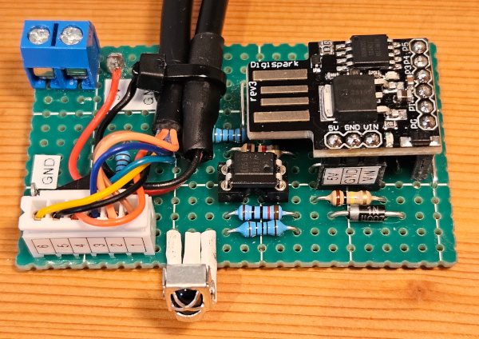

# CambridgeSoundWorksDigitalIRRemote

A Digispark/ATtiny85 DIY based IR (infra-red) remote control for a vintage Cambridge SoundWorks Digital CSW250 2.1 speaker system from 1999. This speaker system is connected to my TV and is responsible for the TV-audio.



The *CambridgeSoundWorksDigitalIRRemote* replaces the original speaker system "remote" control, which has some disadvantages:
- Cable bounded (Max. 2 meters distance)
- Without turning off the speaker system, the speaker system has an idle power consumption of about 7.5 W (even without audio input)[^1]
- With turning off the speaker system, the system has a power consumption of about 3.1 W[^2]
- To turn off the speaker system, the volume level has to be set to minimum volume level
- After turning on the speaker system the previous volume level has to restored manually

The *CambridgeSoundWorksDigitalIRRemote* allows me use the IR wireless controller from my TV to 
- turn on/off the speaker system 
- automatically restore the last used volume level after turning on
- change the volume level 
- mute/unmute

## License and copyright
My [code](CambridgeSoundWorksDigitalIRRemote/CambridgeSoundWorksDigitalIRRemote.ino) and this page is licensed under the terms of the CC0 [Copyright (c) 2025 codingABI](LICENSE). 

### Used external board and libraries from Arduino IDE Board and Library Manager:
- Board: ATTinyCore 1.5.2, LGPL version 2.1 by SpenceKonde 
- Libraries: 
  - IRremote (4.4.1, MIT license)
    - Initially coded 2009 Ken Shirriff http://www.righto.com
    - Copyright (c) 2016-2017 Rafi Khan https://rafikhan.io
    - Copyright (c) 2020-2024 Armin Joachimsmeyer

## Hardware
- Digispark ATtiny85 Microcontroller with reset pin [configured](#pin-5-of-digispark-as-io-pin) as I/O pin
- Digital potentiometer X9C103
- IR-Receiver VS1838B
- Optocoupler 817A
- Cambridge SoundWorks Digital CSW250
- Sony KDL-40W4500 TV with Sony RM-ED011 remote controller

> [!WARNING]
> The *CambridgeSoundWorksDigitalIRRemote* was designed only for my combination: Cambridge SoundWorks Digital CSW250 and Sony KDL-40W4500/Sony RM-ED011. Other TVs/IR-Remote controls could also work, if you find the appropriate IR signals and adjust my [code](CambridgeSoundWorksDigitalIRRemote/CambridgeSoundWorksDigitalIRRemote.ino)

## Used development environment
Arduino IDE 1.8.19 (Without "real portable" support version 2.* makes no sense for me https://forum.arduino.cc/t/arduino-ide-2-0-portable/, https://github.com/arduino/arduino-ide/issues/122 ...)

IDE-Board settings:
- ATtiny85 (Micronucleus / Digispark)
- Clock: "8 MHz (no USB)" (8 MHz reduces the [power consumption](#power-consumption)) 

## Appendix

### Schematic


> [!NOTE]
> The schematic shows a female Mini-DIN-6 connector

### Cambridge SoundWorks Digital CSW250


#### Original remote control

The original remote control is cable bounded and connected by a Mini-DIN-6-Connector to the speaker system. 


After analyzing the PCB I got the following schematic:


> [!NOTE]
> The schematic shows a female Mini-DIN-6 connector

| SW1A | Reaction at the speaker system |
| --- | --- |
| Open | Turned off |
| Closed | Turned on (~1.3 mA between Mini-DIN-6 pin 6 and 3) |

The *CambridgeSoundWorksDigitalIRRemote* replaces the mechanical switch SW1A with an optocoupler. 

| Mini-DIN-6 pin | Color | Connected to speaker system (my assumption) |
| --- | --- | --- |
| 1 | Red | Ground |
| 2 | White | 5.6 V (seems to be regulated) |
| 3 | Green | Turns on/off the audio amplifier (Pin 6 and 3 connected=On, Pin 6 and 3 disconnected=Off) |
| 4 | Yellow | Audio volume level (0.76 V = Minimum volume, 5.14V = Maximum volume)  |
| 5 | Blue | Not connected |
| 6 | Black | Vcc (15-18 V, when Pin 6 and 3 are not connected. Decreases to ~85%, when Pin 6 and 3 are connected) |

The original remote control uses a linear B50K potentiometer RV1. Resistor R201 changes the linear to a non linear behaviour (see the following red line).


The *CambridgeSoundWorksDigitalIRRemote* uses a digital, 100-steps, linear potentiometer with 10K (because I had no 50K). To get a similar non linear behaviour (Green line) and to ensures that my digital potentiometer did not get more then the allowed 5 V, I had to lower the resistors:
- R200 to 1K
- R201 to 5K
- R202 to 2K

### Sony RM-ED011
My Sony TV KDL-40W4500 has a "RM-ED011" IR remote control and the *CambridgeSoundWorksDigitalIRRemote* uses it to control the Cambridge SoundWorks Digital speaker system.


The IRremote example [ReceiveDump](https://github.com/Arduino-IRremote/Arduino-IRremote/blob/master/examples/ReceiveDump/ReceiveDump.ino) shows me the following addresses and commands and I use some of them for the *CambridgeSoundWorksDigitalIRRemote*:

| Button | Address/Device Code | Command |
| :---: | :---: | :---: |
|  | 0x01 | 0x3A |
|  | 0xA4 | 0x3D |
| * | 0x01 | 0x15 |
|  | 0x97 | 0x1B |
|  | 0x97 | 0x1A |
|  | 0x97 | 0x19 |
|  | 0x97 | 0x1C |
|  | 0x1A | 0x58 |
|  | 0x97 | 0x18 |
|  | 0x77 | 0x60 |
| * | 0x77 | 0x52 |
| * | 0x01 | 0x38 |
|  | 0x97 | 0x28 |
|  | 0x01 | 0x17 |
|  | 0xA4 | 0x5B |
|  | 0x01 | 0x25 |
|  | 0x01 | 0x65 |
|  | 0x01 | 0x74 |
|  | 0x01 | 0x75 |
|  | 0x01 | 0x34 |
|  | 0x01 | 0x33 |
|  | 0x97 | 0x23 |
|  | 0x97 | 0x36 |
|  | 0x01 | 0x60 |
|  | 0x03 | 0x4C |
|  | 0x03 | 0x4D |
|  | 0x03 | 0x4E |
|  | 0x03 | 0x4F |
| * | 0x01 | 0x00 |
| * | 0x01 | 0x01 |
| * | 0x01 | 0x02 |
| * | 0x01 | 0x03 |
| * | 0x01 | 0x04 |
| * | 0x01 | 0x05 |
| * | 0x01 | 0x06 |
| * | 0x01 | 0x07 |
| * | 0x01 | 0x08 |
|  | 0x01 | 0x3F |
| * | 0x01 | 0x09 |
|  | 0x77 | 0x76 |
| * | 0x01 | 0x12 |
| * | 0x01 | 0x13 |
| * | 0x01 | 0x10 |
| * | 0x01 | 0x11 |
| * | 0x01 | 0x14 |
|  | 0x01 | 0x3B |

*TV can be turned on with this buttons

### Power consumption

The *CambridgeSoundWorksDigitalIRRemote* gets its 5 V supply voltage from the USB port of my Sony-TV. When the Sony-TV is turned off about ~22 minutes later the USB port will be automatically disconnected. 

Before disconnecting the 5 V supply voltage, the power consumption of the *CambridgeSoundWorksDigitalIRRemote* is dependent on the used voltage on the Digispark "5V"-pin, the clock speed and sleep mode:

| "5V"-pin voltage | Clock speed | Sleep mode | Power consumption | Comment |
| --- | --- | ---- | --- | --- |
| 5.0 V | 16.5 MHz, tuned of USB (USB) | none | 116 mW | 5 V from TV connected to "5V"-Pin of the Digispark |
| 5.0 V | 16.5 MHz, tuned of USB (USB) | SLEEP_MODE_IDLE | 93 mW | 5 V from TV connected to "5V"-Pin of the Digispark |
| 5.0 V | 8 MHz (no USB) | none | 96 mW | 5 V from TV connected to "5V"-Pin of the Digispark |
| 5.0 V | 8 MHz (no USB) | SLEEP_MODE_IDLE | 80 mW | 5 V from TV connected to "5V"-Pin of the Digispark |
| 4.7 V | 8 MHz (no USB) | SLEEP_MODE_IDLE | 70 mW | 5 V from TV connected to Digispark USB port (My Digispark uses a S4 Schottky diode with a forward voltage of ~0.3 V)[^3] |
| 4.3 V | 8 MHz (no USB) | SLEEP_MODE_IDLE | 65 mW | 5 V from TV connected via a 1N4007 diode to "5V"-Pin of the Digispark[^4] |

Below 8 MHz the ATtiny85 can not receive IR signals from my Sony RM-ED011 (At least with the used library IRremote). 

As as result of this table the *CambridgeSoundWorksDigitalIRRemote* uses 4.3 V, "8 MHz (no USB)" and SLEEP_MODE_IDLE 

=> **65 mW** power consumption[^5]. 

### Pin 5 of Digispark as I/O pin

My Digispark clone uses pin 5 as a reset pin. To use this pin as an I/O pin I had to change a fuse:

```
hardware\tools\avr\bin\avrdude.exe -P com4 -C hardware\tools\avr\etc\avrdude.conf -b 19200 -c avrisp -p attiny85 -n
hardware\tools\avr\bin\avrdude.exe -P com4 -C hardware\tools\avr\etc\avrdude.conf -b 19200 -p attiny85 -c avrisp -U hfuse:w:0x5F:m 
```

> [!WARNING]
> After that the Digispark can only be programmed by a USB-micronucleus-bootloader or a high voltage programmer!

Pin 5 is a "weak" pin and can not provide as much power as the other I/O pins, but can provide the needed ~1.5 mA to drive the used optocoupler.

[^1]:Replacing the original power supply TEAD-66-153000V with a smaller/newer 15 V power supply (for example https://www.amazon.de/dp/B0D2K7L311?ref=ppx_yo2ov_dt_b_fed_asin_title) reduces the idle power consumption to 3.8 W

[^2]:Replacing the original power supply TEAD-66-153000V with a smaller/newer 15 V power supply (for example https://www.amazon.de/dp/B0D2K7L311?ref=ppx_yo2ov_dt_b_fed_asin_title) reduces turned off consumption to ~0 W

[^3]:"Pin high" voltage for pin 5=2.4 V, optocoupler If=1.6 mA, Ic=1.3 mA, Uceo=0.2 V 

[^4]:"Pin high" voltage for Pin 5=2.2 V, optocoupler If=1.4 mA, Ic=1.1 mA, Uceo=1.8 V (not optimal, but working)

[^5]:Most of the power is not consumed by the ATtiny85. About 75% are consumed by the other used electronic components (Builtin LED, driving the optocoupler, digital potentiometer, USB data lines,...)
